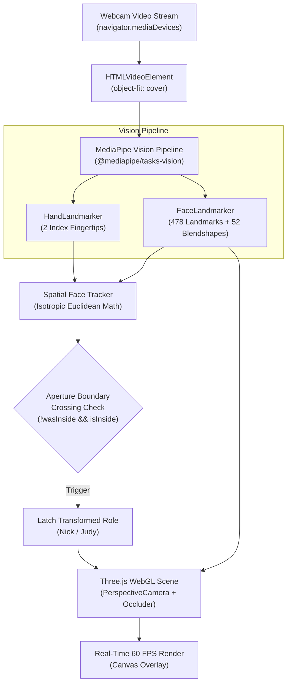
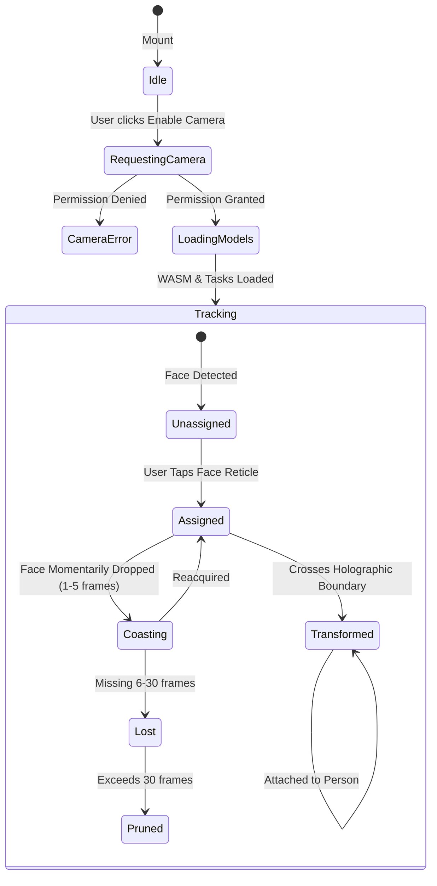

# Technical Architecture • AR Portal

Comprehensive architectural specifications, data flow pipelines, coordinate systems, and component hierarchies for the **Understand AR Portal** engine.

---

## 1. High-Level Data Flow

---

## 2. Spatial Coordinate System & Projection Pipeline

1. **Normalized Space $[0, 1] \times [0, 1]$**:
   - MediaPipe outputs $(x, y)$ in normalized video texture space.
2. **Aspect-Corrected Isotropic Space**:
   - $\text{aspect} = \frac{W_{\text{video}}}{H_{\text{video}}}$.
   - $x_{\text{iso}} = x \cdot \text{aspect}$, $y_{\text{iso}} = y$.
   - Prevents anamorphic distortion when calculating distances, fingertip angles, and aperture containment.
3. **Screen Pixel Space**:
   - Mapped according to CSS `object-fit: cover` with letterboxing/cropping offsets:
   - $\text{scale} = \max(\frac{W_{\text{container}}}{W_{\text{video}}}, \frac{H_{\text{container}}}{H_{\text{video}}})$.
4. **Three.js World Frustum Space**:
   - Projected to Three.js camera coordinate frame at face depth plane $Z_{\text{depth}}$:
   - $X_{\text{world}} = (2 \frac{X_{\text{screen}}}{W} - 1) \cdot \frac{W_{\text{frustum}}}{2}$.
   - $Y_{\text{world}} = -(2 \frac{Y_{\text{screen}}}{H} - 1) \cdot \frac{H_{\text{frustum}}}{2}$.

---

## 3. State Machine & Dropout Coasting Grace Periods

---

## 4. Key Performance Optimizations

* **Zero Memory Leak Lifecycle**: Explicit disposal of Three.js geometries, materials, textures, and MediaPipe landmarkers on unmount.
* **Gated Frame Processing**: MediaPipe inference runs strictly when `video.currentTime !== lastVideoTime` (~30 FPS), decoupled from the 60 FPS WebGL rendering loop.
* **Monotonic Clamping**: Timestamps clamped to strictly increasing values to eliminate browser timer clamping exceptions.
* **Double-Buffered Filtering**: Adaptive 1-Euro and Exponential Moving Average (EMA) filters suppress sensor jitter while eliminating tracking lag.
